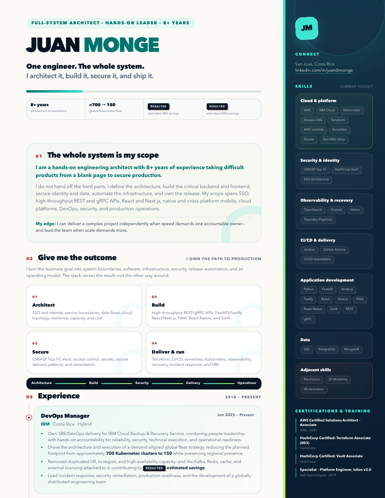
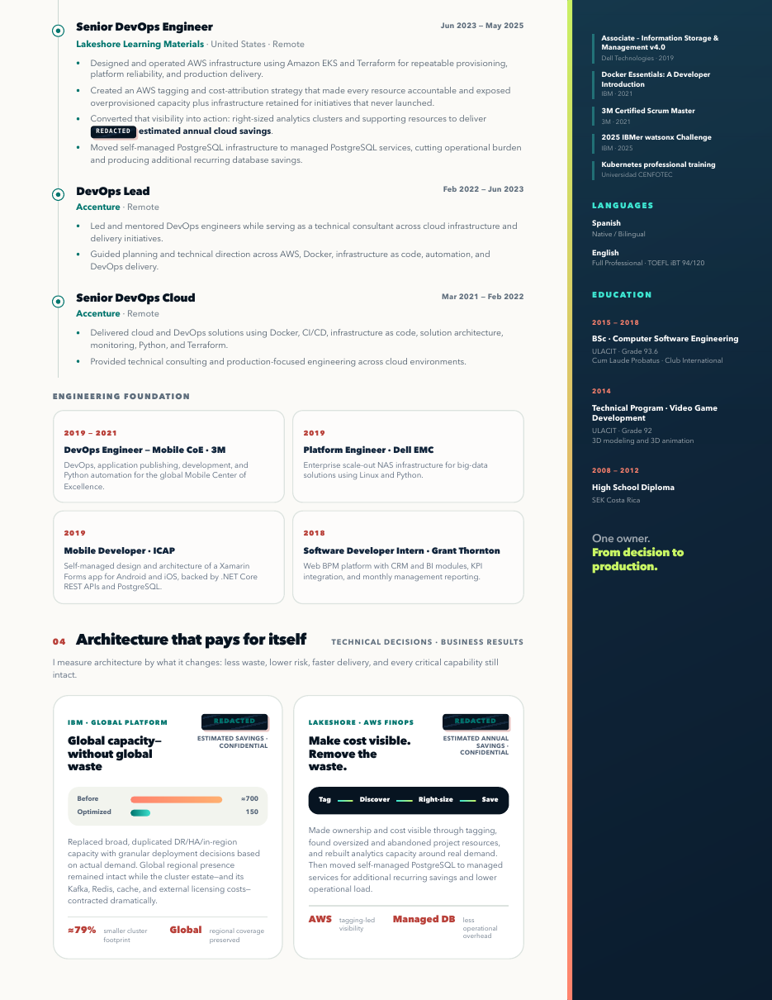

# Juan Monge

**Full-System Architect · Hands-On Leader · 8+ Years**

One engineer. The whole system. I architect it, build it, secure it, and ship it.

[Open the live HTML résumé](https://juandi-m.github.io/juan-monge-resume/) · [Download the PDF](./Juan_Monge_Resume.pdf) · [LinkedIn](https://www.linkedin.com/in/juandimonge)

## About this edition

This is the public portfolio edition. Exact monetary impact figures are intentionally presented with a classified-style `REDACTED` treatment while the engineering scope, career history, infrastructure scale, skills, certifications, and education remain visible.

## Contents

- `index.html` — responsive résumé and GitHub Pages entry point
- `resume.css` and `resume-impact.css` — screen, mobile, accessibility, and print styling
- `Juan_Monge_Resume.pdf` — two-page Letter PDF for quick reference
- `assets/` — README preview images rendered from the résumé
